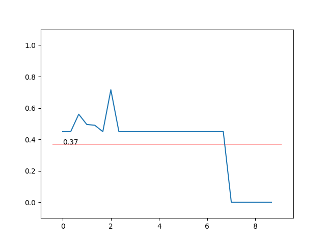

# ActionRecognition
Action recognition semester project for Advanced Topics in Deep Learning: CSCE 689

### How to run demo

Running the demo requires PyAV
- `>>> brew install ffmpeg pkg-config` or `>>> conda install av -c conda-forge`
or if you need some other way to install: [installation instructions](https://docs.mikeboers.com/pyav/develop/overview/installation.html)
- `>>> cd demo`
- `>>> pip install -r requirements.txt`
- `>>> python demo.py` or `>>> python demo.py --vidpath ./videos/myvid.mp4`

You can see the full report [here](https://github.com/josiahcoad/ActionRecognition/blob/master/689%20Report%201.pdf)

See example of running demo [here](https://youtu.be/Yi-h_lC-KSg).

The trained *model.pth* file is [here](https://github.com/josiahcoad/ActionRecognition/blob/master/demo/assets/model.pth)
